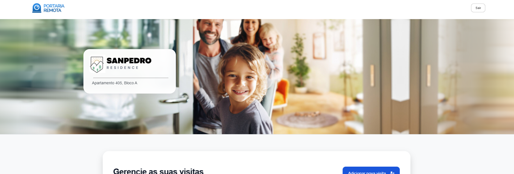
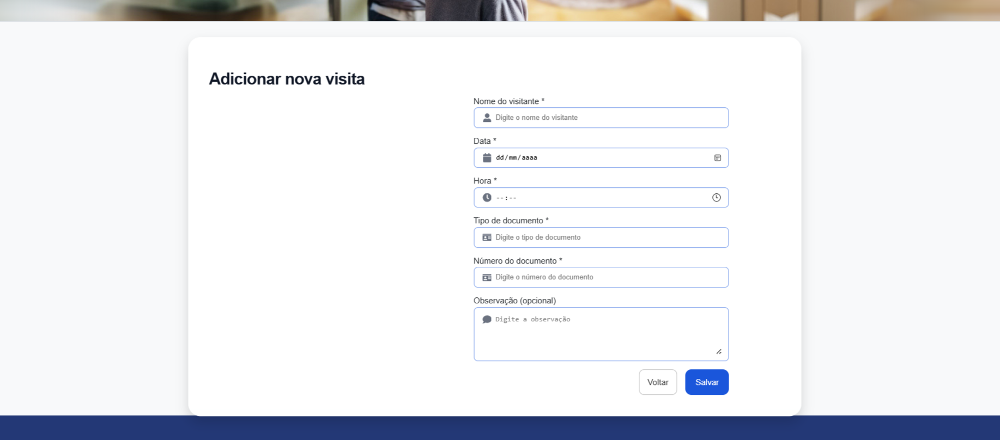

# Portaria Remota

Sistema de portaria remota desenvolvido com Vite + React. Permite o cadastro e listagem de visitas de forma eficiente.

## Tecnologias utilizadas
- Vite
- React
- Context API
- React Router

## Capturas de tela

### Header


### Lista de Visitas


### Página de novas visitas



### Footer
.png)

## Instalação e uso
Clone o repositório e instale as dependências:

```sh
git clone https://github.com/seu-usuario/portaria-remota.git
cd portaria-remota
npm install
npm run dev
